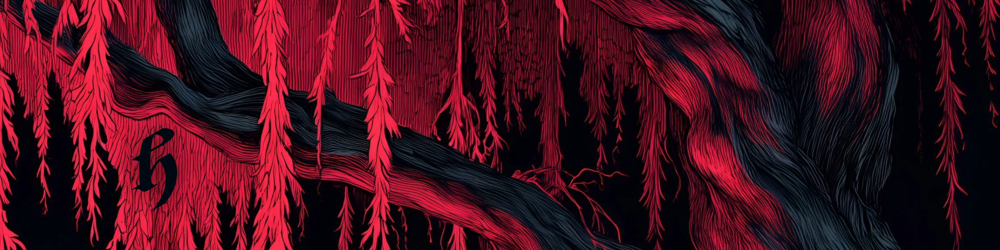

<!-- Banner placeholder — replace with your brand image -->
<!-- Recommended size: 1280x640px or similar 2:1 ratio -->

# HYPERCODE

**A premium roleplay system prompt framework by Hyperion.**

HYPERCODE is a modular, tiered system prompt designed for immersive, literary-quality interactive roleplay with AI. Whether you need a full cinematic narrative engine or a lean token-efficient skeleton, there's a version built for your setup.

---

## What's Included

HYPERCODE ships in three tiers. Pick the one that fits your setup, or start with Core and build up.

| Tier | File | What It Is | Best For |
|------|------|-----------|----------|
| **Premium** | [`premium.md`](prompts/v1.0/premium.md) | Full-featured prompt with structural depth, tonal philosophy, and narrative discipline. | Users who want a polished, ready-to-go cinematic roleplay experience. |
| **Essentials** | [`essentials.md`](prompts/v1.0/essentials.md) | Compact and effective. Covers all the fundamentals in a token-efficient package. | Smaller context windows, mobile setups, or users who prefer brevity. |
| **Core** | [`core.md`](prompts/v1.0/core.md) | Stripped-down framework. Style-agnostic — bring your own voice, POV, and format. | Experienced users who want a foundation to customize entirely. |

All three tiers are platform-agnostic and work with any frontend or model that accepts a system prompt.

## Customization

HYPERCODE is designed to be modular. The [**Customization Guide**](guides/customization.md) provides drop-in replacements for perspective, tense, response length, prose tone, dialogue style, and mature content handling. Swap the pieces you want, keep the rest at their defaults.

## Versions

HYPERCODE is actively maintained. Current and past versions are available in the [`prompts/`](prompts/) directory.

| Version | Status | Notes |
|---------|--------|-------|
| [v1.0](prompts/v1.0/) | **Current** | Initial public release. |

---

## The Full Experience

HYPERCODE is one piece of a larger ecosystem. If you want to experience what these prompts can really do when paired with handcrafted characters, deep worldbuilding, and a curated community check out below:

**Timeless Tavern** is a SillyTavern instance hosted by me, Hyperion. Multi-user, multi-world, and running on a prompt architecture that goes well beyond what's published here. Access is through the [**Discord**](https://discord.gg/therealhype).

## Other Ways to Connect

- **Discord** — [Hype Discord](https://discord.gg/therealhype) — Community, support, and access to Timeless Tavern.
- **Ko-fi** — [ko-fi.com/hype](https://ko-fi.com/hype) — Support the work. Memberships and commissions available.
- **The Hyperium** — [Substack](https://hyperionblackthorne.substack.com) — Writing, worldbuilding, and studio updates.
- **Tumblr** — [@hyperionblackthorne](https://hyperionblackthorne.tumblr.com) — AI art and dark aesthetic.

---

## License

HYPERCODE is released under [CC BY-NC-SA 4.0](LICENSE). You're free to use, share, and adapt it with attribution — just not commercially. See the license file for full terms.

## Contributing

Found something that could be better? Have a suggestion for the Customization Guide? Open an issue or submit a PR. Community contributions that improve the framework are welcome.

If you build something cool with HYPERCODE, I'd love to hear about it — drop into the [Discord](https://discord.gg/therealhype) and share.

---

  
  &nbsp;&nbsp;
  

<em>Crafted by Hyperion</em>

